# Treinamento: Compliance e Proteção de Dados (LGPD) na Prática

Este projeto documenta o desenvolvimento e a aplicação de um treinamento focado em **Segurança da Informação e LGPD**, elaborado para mitigar riscos operacionais e fortalecer a cultura de compliance em uma empresa prestadora de serviços.

## 📌 Contexto e Objetivo
A empresa em questão atua como parceira de uma grande corporação nacional. Identificou-se que qualquer falha na manipulação de dados poderia comprometer essa parceria estratégica.

O objetivo foi capacitar a equipe (especialmente o setor de captação de leads) para entender que o cuidado com os dados é um pilar ético e um diferencial competitivo.

## 📚 Embasamento Teórico
* **PUCRS:** Curso de Extensão em Compliance e Proteção de Dados.
* **Fundação Bradesco:** Segurança da Informação.
* **Fundação Bradesco:** Introdução à LGPD.

## 🛠️ Conteúdo Didático e Slides
O treinamento foi estruturado em slides, focando na clareza para colaboradores de diferentes áreas.

### Visualização dos Slides:
### 📸 Material Completo do Treinamento
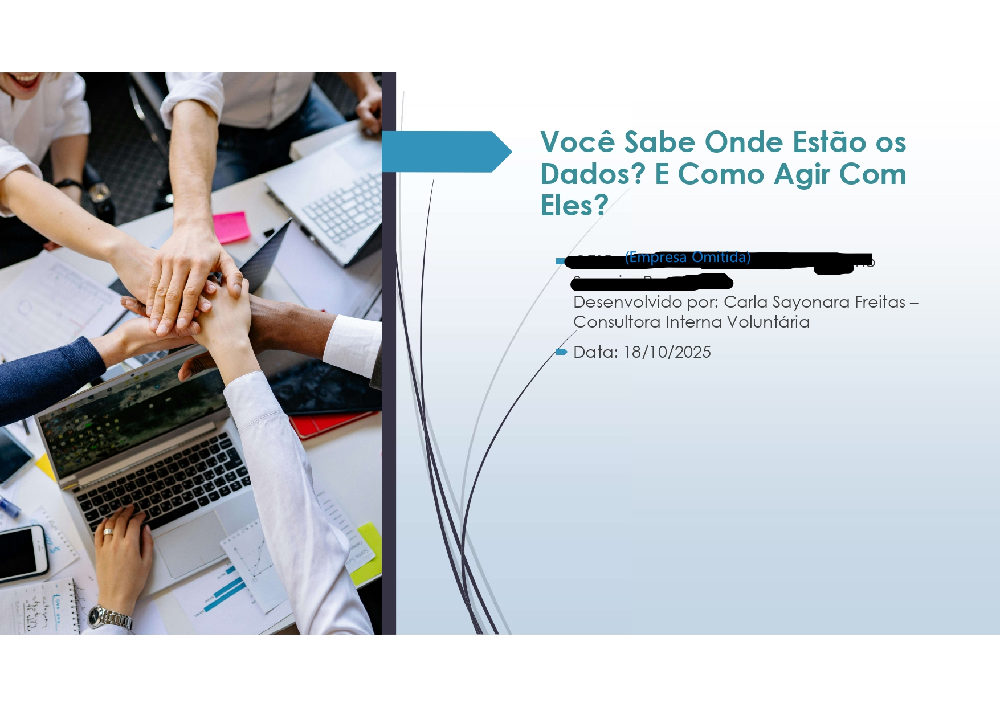
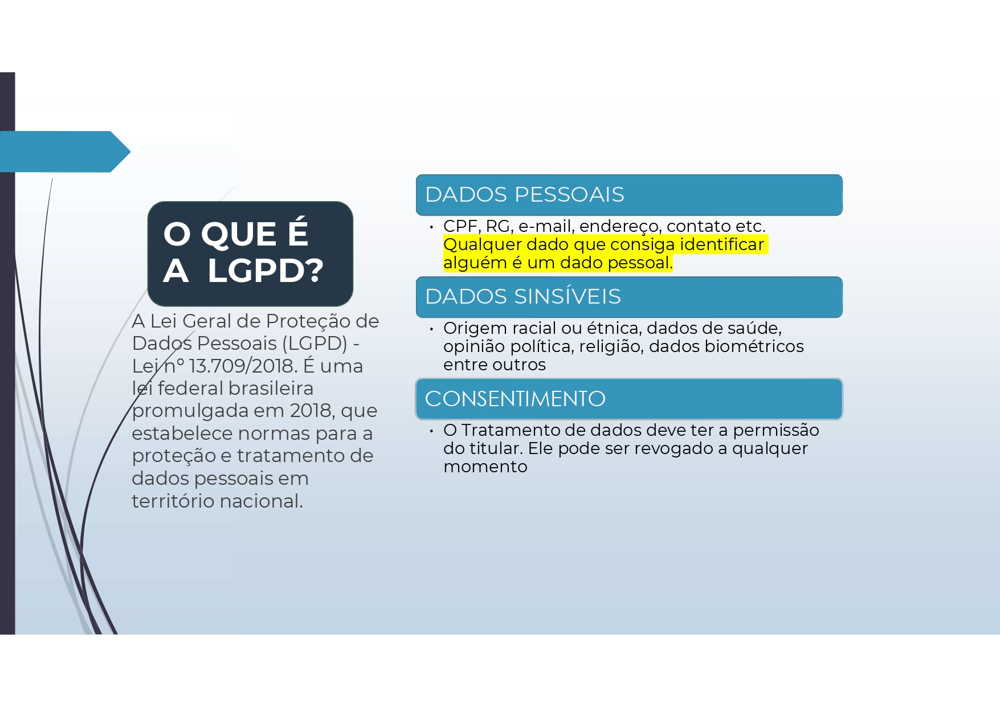
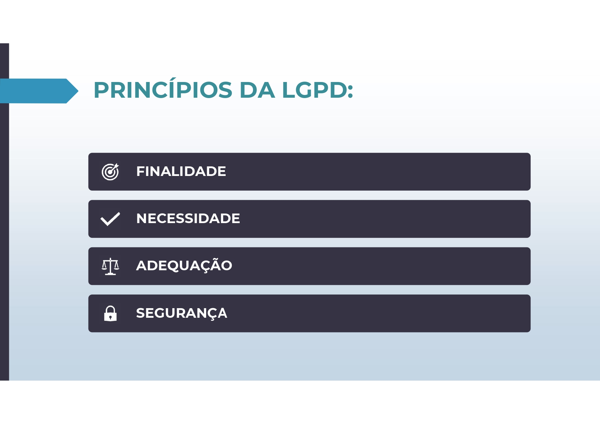
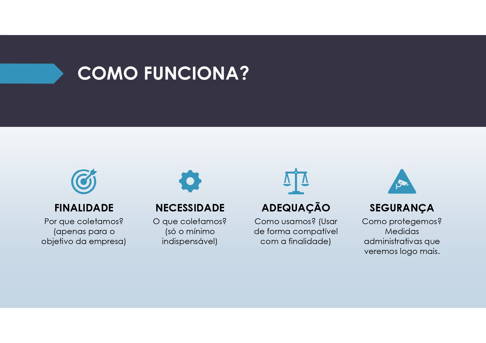
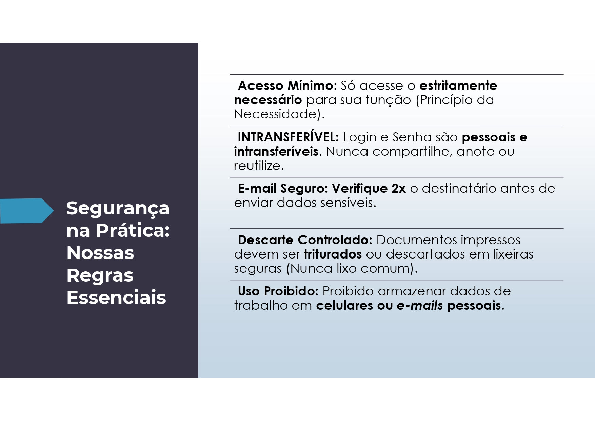
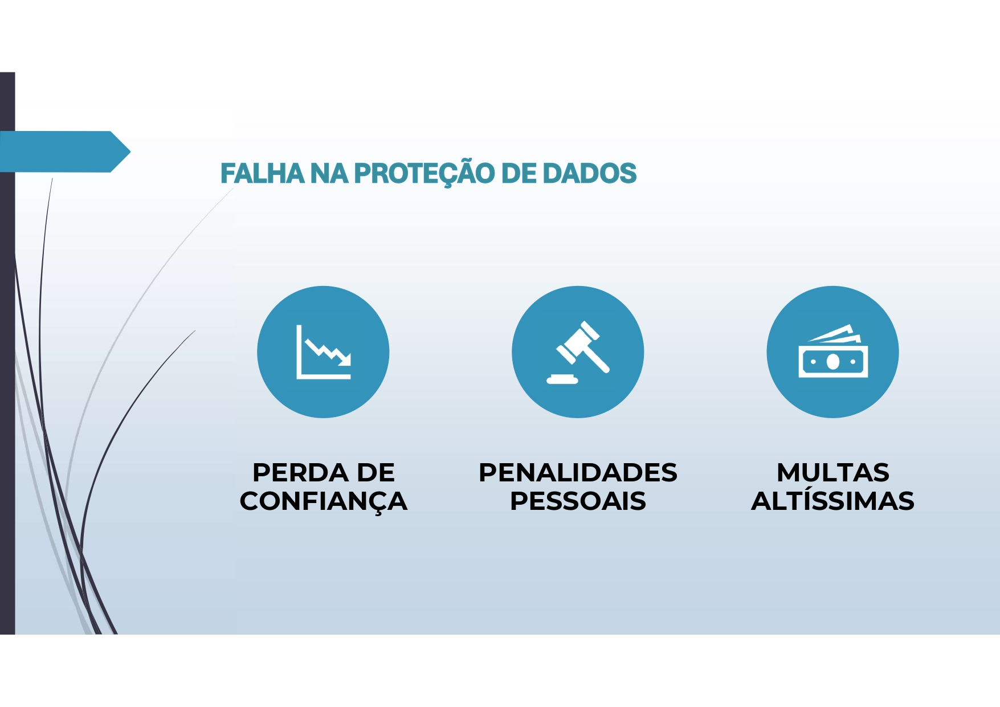
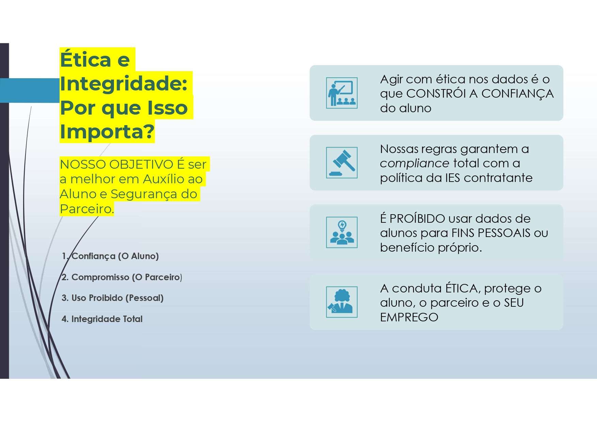
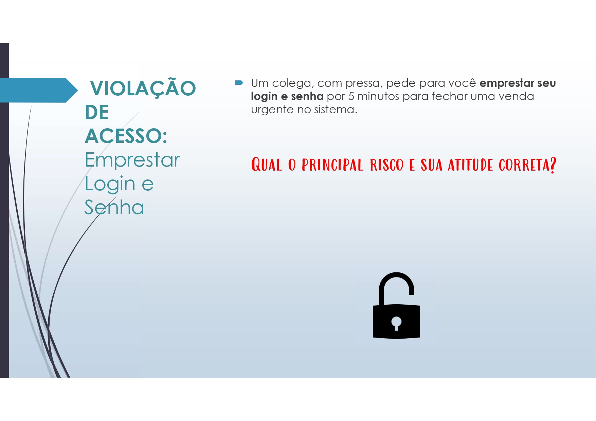
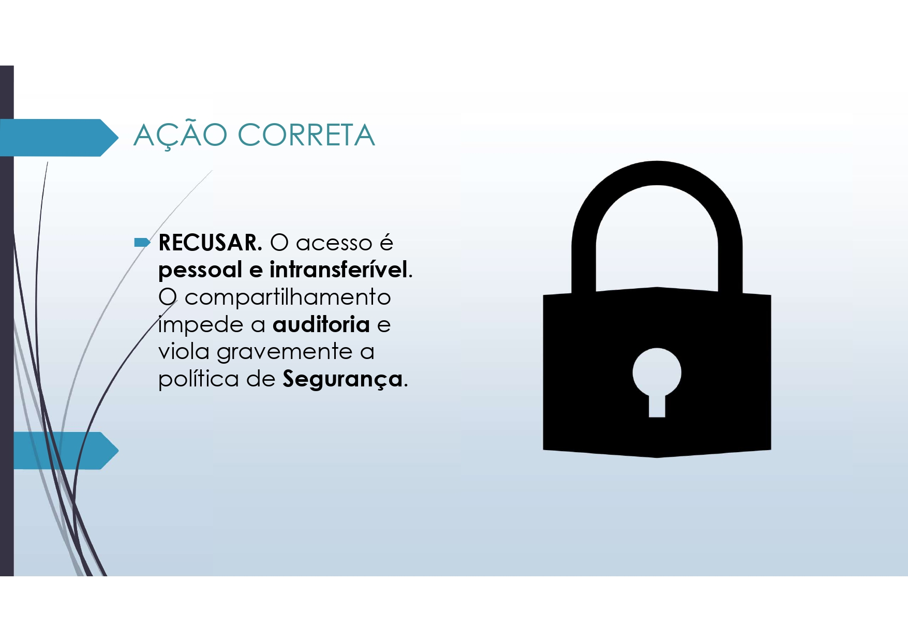
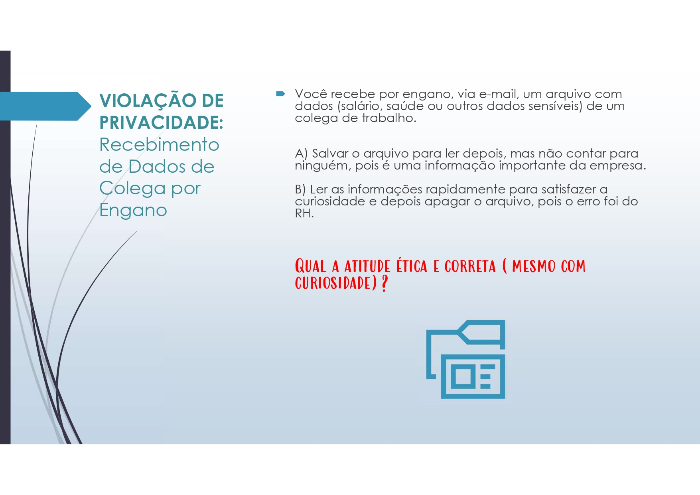
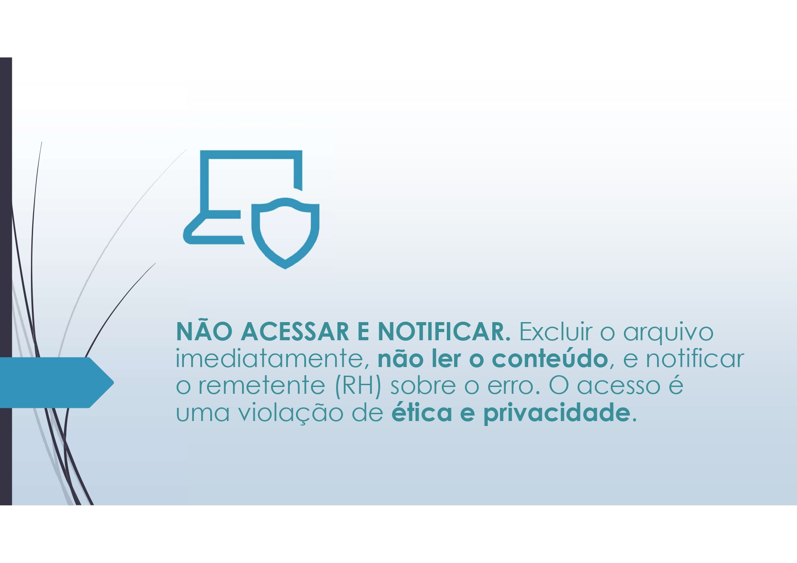
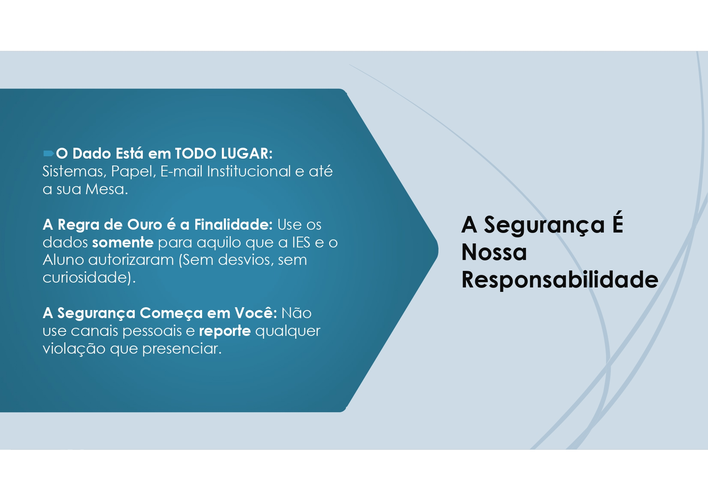
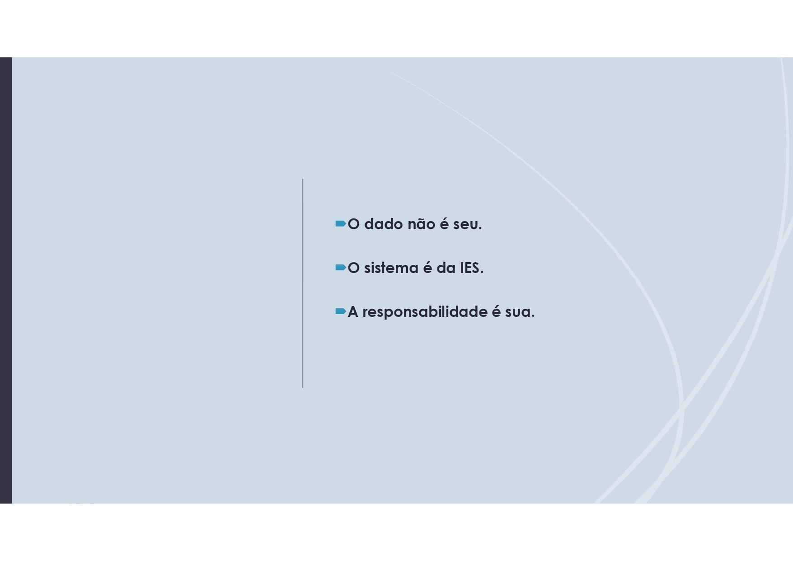

## 📊 Metodologia e Resultados
* **Interatividade:** Slides com perguntas e respostas para fixação.
* **Avaliação:** Aplicação de formulário de aproveitamento.
* **Métricas:** O grupo obteve uma média de **4.8 de aproveitamento**.

## 📈 Evolução Observada
* **Segurança de Acesso:** Fim do compartilhamento de senhas.
* **Privacidade:** Consultas limitadas ao setor pertinente ou com consentimento.
* **Consciência:** Maior zelo na captação de leads (Tríade CID).

> **Nota:** Nomes de empresas e dados sensíveis foram borrados para garantir o Compliance e o sigilo profissional.
